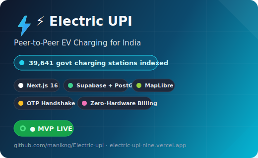
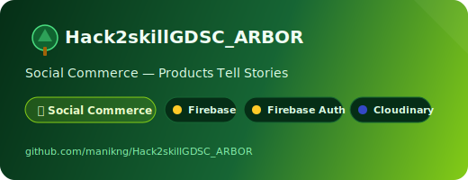
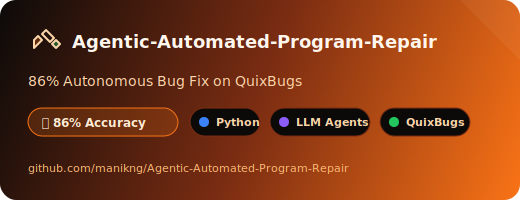

<!-- ════════════════════════════════════════════════════════════════
     MANIKNG — GitHub Profile README
     Static SVG cards (no API rate-limits, no placeholders)
     ════════════════════════════════════════════════════════════════ -->
<!-- BLOCK 1 - Header wave (MANISH SINGH) -->

  

<!-- BLOCK 2 - Typing animation -->

  

 

<!-- SOCIAL BADGES -->

  
  
  
  

 

--- 

<!-- ════════════════════════════════════════════════════════════════
     FEATURED PROJECT — ELECTRIC UPI
     ════════════════════════════════════════════════════════════════ -->
##  Electric UPI — Peer-to-Peer EV Charging for India

  

 

  
  
  

 

<table align="center">
  <tr>
    <td align="left" width="50%">
      <h3>What it does</h3>
      
A peer-to-peer EV charging marketplace for India. Hosts list their chargers, drivers discover them on an interactive map, book a slot via OTP handshake, and pay through zero-hardware billing — no physical meter required.

    </td>
    <td align="left" width="50%">
      <h3>Key highlights</h3>
      <ul>
        <li><b>39,641</b> govt charging stations indexed from OpenChargeMap</li>
        <li>OTP-based booking state machine (pending → confirmed → charging → completed)</li>
        <li>PostGIS spatial queries for nearby charger discovery</li>
        <li>24 API routes across App Router (Server Actions + Route Handlers)</li>
        <li>MapLibre GL JS + MapTiler for interactive map rendering</li>
        <li>Zero-hardware billing — UPI-style virtual metering</li>
      </ul>
    </td>
  </tr>
</table>

 

--- 

<!-- ════════════════════════════════════════════════════════════════
     WHAT I'VE BUILT — STATIC SVG CARDS (no API rate-limits)
     ════════════════════════════════════════════════════════════════ -->
##  What I've Built

  <table>
    <tr>
      <td align="center" width="50%">
        
      </td>
      <td align="center" width="50%">
        
      </td>
    </tr>
    <tr>
      <td align="center" colspan="2">
        
      </td>
    </tr>
  </table>

 

--- 

<!-- ════════════════════════════════════════════════════════════════
     TECH STACK
     ════════════════════════════════════════════════════════════════ -->
##  Stack I Reach For

 

--- 

<!-- ════════════════════════════════════════════════════════════════
     GITHUB STATS
     ════════════════════════════════════════════════════════════════ -->
##  GitHub Stats

  
  
  

  

 

--- 

<!-- ════════════════════════════════════════════════════════════════
     CONNECT
     ════════════════════════════════════════════════════════════════ -->
##  Let's Connect

  
  
  
  
  
  

 

  <i>Building for India 🇮🇳 — one commit at a time.</i>

 

<!-- SNAKE ANIMATION -->

  

<!-- FOOTER WAVE -->

  

